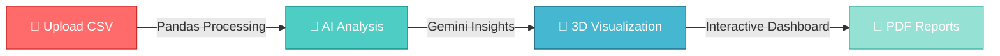

<div align="center">


<div align="center">
</div>

<br/>

<p align="center">
  
  
  
  
  
</p>

<p align="center">
  <a href="https://github.com/RITHIKKUMARAN/ChemFlow-Analytics/blob/master/LICENSE">
    
  </a>
  <a href="https://chemflow-rk.vercel.app">
    
  </a>
  
  
</p>

<br/>

<a href="https://chemflow-rk.vercel.app" target="_blank">
</a>

<br/><br/>

<p align="center">
  <a href="#-what-is-chemflow"><kbd> 📖 Overview </kbd></a>
  <a href="#-core-features"><kbd> ✨ Features </kbd></a>
  <a href="#-technology-powerhouse"><kbd> 🛠️ Tech Stack </kbd></a>
  <a href="#-quick-start"><kbd> 🚀 Get Started </kbd></a>
  <a href="#-showcase"><kbd> 🎨 Showcase </kbd></a>
  <a href="#-contributing"><kbd> 🤝 Contribute </kbd></a>
</p>

</div>

---

<br/>


<div align="center">

## 🌟 What is ChemFlow?

</div>

<br/>

<table align="center">
<tr>
<td width="50%" align="center">

### 🎯 **The Problem**

Engineers struggle with:
- 📊 Static, lifeless data tables
- 🔍 Hidden patterns in equipment metrics
- ⏱️ Time-consuming manual analysis
- 📉 Reactive failure management
- 🖥️ Platform-locked tools

</td>
<td width="50%" align="center">

### ✅ **The Solution**

ChemFlow delivers:
- 🌐 **Immersive 3D Digital Twins**
- 🤖 **AI-Powered Diagnostics**
- ⚡ **Real-Time Monitoring**
- 📱 **Web + Desktop Hybrid**
- 🎨 **Stunning Glassmorphic UI**

</td>
</tr>
</table>

<br/>

<div align="center">

### 🚀 **From Data to Insights in 3 Steps**



</div>

<br/>

---

<div align="center">

## ✨ Core Features


</div>

<br/>

<table>
<tr>
<td width="33%" align="center">

### 🌐 **3D Digital Twin**


**Immersive Visualization**
- React Three Fiber scenes
- Real-time parameter mapping
- Interactive equipment nodes
- Voice-controlled navigation
- Physics-based animations

</td>
<td width="33%" align="center">

### 🤖 **AI Process Assistant**


**Gemini-Powered Intelligence**
- Predictive failure analysis
- Optimization recommendations
- Natural language queries
- Context-aware responses
- Safety audit automation

</td>
<td width="33%" align="center">

### 📊 **Advanced Analytics**


**Interactive Dashboards**
- Chart.js visualizations
- Historical trend analysis
- Real-time monitoring
- Custom alert thresholds
- One-click PDF export

</td>
</tr>

<tr>
<td width="33%" align="center">

### 💻 **Hybrid Platform**


**Web + Desktop**
- Beautiful React web app
- Native PyQt5 desktop app
- Single Django API backend
- Offline capability
- Cross-platform support

</td>
<td width="33%" align="center">

### 🔐 **Enterprise Security**


**Production-Ready**
- JWT authentication
- Password encryption
- CORS protection
- Input validation
- Environment variables

</td>
<td width="33%" align="center">

### ⚡ **Lightning Fast**


**Optimized Performance**
- Vite build system
- Lazy loading
- Efficient rendering
- Smart caching
- GSAP animations

</td>
</tr>
</table>

<br/>

---

<div align="center">

## 🛠️ Technology Powerhouse


</div>

<br/>

### 🎨 **Frontend Arsenal**

<div align="center">

<table>
<tr>
<td align="center" width="140">

<br><b>React 18.2</b>
<br><sub>UI Framework</sub>
</td>
<td align="center" width="140">

<br><b>Three.js</b>
<br><sub>3D Graphics</sub>
</td>
<td align="center" width="140">

<br><b>Vite</b>
<br><sub>Build Tool</sub>
</td>
<td align="center" width="140">

<br><b>Tailwind CSS</b>
<br><sub>Styling</sub>
</td>
<td align="center" width="140">

<br><b>JavaScript</b>
<br><sub>Language</sub>
</td>
</tr>
</table>

**Additional Libraries:**
`@react-three/fiber` • `@react-three/drei` • `GSAP` • `Chart.js` • `Axios` • `Lucide React` • `Maath`

</div>

<br/>

### ⚙️ **Backend Infrastructure**

<div align="center">

<table>
<tr>
<td align="center" width="140">

<br><b>Django 4.2</b>
<br><sub>Framework</sub>
</td>
<td align="center" width="140">

<br><b>Python 3.9+</b>
<br><sub>Language</sub>
</td>
<td align="center" width="140">

<br><b>SQLite</b>
<br><sub>Database</sub>
</td>
<td align="center" width="140">

<br><b>Pandas</b>
<br><sub>Data Processing</sub>
</td>
<td align="center" width="140">

<br><b>Gemini AI</b>
<br><sub>Intelligence</sub>
</td>
</tr>
</table>

**Additional Tools:**
`Django REST Framework` • `JWT` • `ReportLab` • `CORS Headers` • `dotenv`

</div>

<br/>

### 🖥️ **Desktop Application**

<div align="center">

<table>
<tr>
<td align="center" width="140">

<br><b>PyQt5 5.15</b>
<br><sub>GUI Framework</sub>
</td>
<td align="center" width="140">

<br><b>Python</b>
<br><sub>Language</sub>
</td>
<td align="center" width="140">

<br><b>Matplotlib</b>
<br><sub>Plotting</sub>
</td>
<td align="center" width="140">

<br><b>Requests</b>
<br><sub>HTTP Client</sub>
</td>
</tr>
</table>

</div>

<br/>

---

<div align="center">

## 🏗️ System Architecture

```
                    ┏━━━━━━━━━━━━━━━━━━━━━━━━━━━━━━━━━┓
                    ┃   🌐 ChemFlow Analytics         ┃
                    ┃   Unified Hybrid Platform       ┃
                    ┗━━━━━━━━━━━━━━┳━━━━━━━━━━━━━━━━━━┛
                                   │
                    ┏━━━━━━━━━━━━━━▼━━━━━━━━━━━━━━┓
                    ┃  🔧 Django REST API          ┃
                    ┃  • JWT Auth                  ┃
                    ┃  • Pandas Processing         ┃
                    ┃  • Gemini AI Integration     ┃
                    ┃  • PDF Generation            ┃
                    ┗━━━━━┳━━━━━━━━━━━━━━━┳━━━━━━━┛
                          │               │
            ┏━━━━━━━━━━━━━▼━━━━━┓   ┏━━━━▼━━━━━━━━━━━━━━┓
            ┃  💻 Web Frontend  ┃   ┃ 🖥️ Desktop App     ┃
            ┃  • React 18       ┃   ┃ • PyQt5            ┃
            ┃  • Three.js 3D    ┃   ┃ • Matplotlib       ┃
            ┃  • GSAP Animations┃   ┃ • Offline Mode     ┃
            ┃  • Chart.js       ┃   ┃ • Native UI        ┃
            ┗━━━━━━━━━━━━━━━━━━━┛   ┗━━━━━━━━━━━━━━━━━━━━┛
```

</div>

<br/>

---

<div align="center">

## 🚀 Quick Start


</div>

<br/>

### 📋 **Prerequisites**

<table>
<tr>
<td align="center" width="25%">

<br><b>Node.js 18+</b>
<br><a href="https://nodejs.org/">Download</a>
</td>
<td align="center" width="25%">

<br><b>Python 3.9+</b>
<br><a href="https://python.org/">Download</a>
</td>
<td align="center" width="25%">

<br><b>Git</b>
<br><a href="https://git-scm.com/">Download</a>
</td>
<td align="center" width="25%">

<br><b>Gemini API Key</b>
<br><a href="https://ai.google.dev/">Get Free</a>
</td>
</tr>
</table>

<br/>

### ⚡ **Installation Options**

<details>
<summary><b>🎯 Option 1: Automated Setup (Recommended)</b></summary>

<br/>

**For Windows:**
```bash
git clone https://github.com/RITHIKKUMARAN/ChemFlow-Analytics.git
cd ChemFlow-Analytics
setup.bat
```

**For macOS/Linux:**
```bash
git clone https://github.com/RITHIKKUMARAN/ChemFlow-Analytics.git
cd ChemFlow-Analytics
chmod +x setup.sh
./setup.sh
```

</details>

<details>
<summary><b>🔧 Option 2: Manual Setup</b></summary>

<br/>

**1️⃣ Backend Setup**
```bash
cd backend
python -m venv venv

# Activate virtual environment
# Windows:
venv\Scripts\activate
# macOS/Linux:
source venv/bin/activate

pip install -r requirements.txt
cp .env.example .env
# Edit .env and add your GEMINI_API_KEY

python manage.py migrate
python manage.py runserver
```
✅ Backend running at `http://localhost:8000`

<br/>

**2️⃣ Web Frontend Setup**
```bash
cd web-frontend
npm install
npm run dev
```
✅ Frontend running at `http://localhost:5173`

<br/>

**3️⃣ Desktop App Setup**
```bash
cd desktop-app
python -m venv venv
venv\Scripts\activate  # or source venv/bin/activate
pip install -r requirements.txt
python main.py
```
✅ Desktop app launched!

</details>

<br/>

### 🔑 **Environment Configuration**

Create `.env` file in `backend/` and `web-frontend/` directories:

**backend/.env:**
```env
GEMINI_API_KEY=your_gemini_api_key_here
SECRET_KEY=your_django_secret_key
DEBUG=True
```

**web-frontend/.env:**
```env
VITE_API_URL=http://localhost:8000
VITE_GEMINI_API_KEY=your_gemini_api_key_here
```

> 💡 **Get your free Gemini API key:** [https://ai.google.dev/](https://ai.google.dev/)

<br/>

---

<div align="center">

## 📖 Usage Guide

</div>

<br/>

<table>
<tr>
<td width="25%" align="center">

### 1️⃣ **Register**


Create your account on the web app or desktop application

</td>
<td width="25%" align="center">

### 2️⃣ **Upload Data**


Drag & drop your CSV file with equipment parameters

</td>
<td width="25%" align="center">

### 3️⃣ **Visualize**


Explore 3D models, charts, and AI insights

</td>
<td width="25%" align="center">

### 4️⃣ **Export**


Download professional PDF reports

</td>
</tr>
</table>

<br/>

### 📊 **Sample Data Format**

Your CSV file should include these columns:

```csv
Equipment_ID,Equipment_Type,Flowrate,Pressure,Temperature
EQ001,Reactor,150.5,25.3,350.2
EQ002,Heat Exchanger,200.8,30.5,280.5
EQ003,Pump,180.2,45.8,120.3
EQ004,Distillation Column,220.1,15.2,180.7
```

📥 **Download Sample:** [sample_equipment_data.csv](sample_equipment_data.csv)

<br/>

---

<div align="center">

## 🎨 Showcase


</div>

<br/>

<table>
<tr>
<td width="50%">

### 🌐 **Web Application**

- 🎨 Glassmorphic design language
- 🌊 Fluid GSAP animations
- 🎯 Interactive 3D equipment models
- 📊 Real-time Chart.js visualizations
- 🤖 AI chat interface
- 📱 Fully responsive layout

</td>
<td width="50%">

### 🖥️ **Desktop Application**

- 🎨 Modern dark theme UI
- 📊 Matplotlib chart integration
- 🔒 Offline mode support
- ⚡ Native performance
- 📄 Direct PDF export
- 💾 Local data management

</td>
</tr>
</table>

<br/>

<div align="center">

### 🌟 **Key Highlights**

| Feature | Web App | Desktop App |
|---------|:-------:|:-----------:|
| **3D Visualization** | ✅ (Three.js) | ⬜ |
| **AI Assistant** | ✅ | ✅ |
| **Offline Mode** | ⬜ | ✅ |
| **PDF Export** | ✅ | ✅ |
| **Voice Control** | ✅ | ⬜ |
| **Chart Analytics** | ✅ | ✅ |
| **History Management** | ✅ | ✅ |
| **Responsive Design** | ✅ | ✅ |

</div>

<br/>

---


<div align="center">

## 💼 Real-World Applications

</div>

<br/>

<table>
<tr>
<td width="33%" align="center">

### 🏭 **Plant Managers**


- Monitor equipment health
- Predict maintenance needs
- Optimize production flow
- Generate compliance reports
- Track performance metrics

</td>
<td width="33%" align="center">

### 🔬 **Process Engineers**


- Analyze parameter correlations
- Simulate failure scenarios
- Optimize process conditions
- Validate design specifications
- Benchmark equipment

</td>
<td width="33%" align="center">

### 🎓 **Researchers**


- Visualize experimental data
- Identify trends and patterns
- Generate publication-ready charts
- Collaborative data sharing
- Historical analysis

</td>
</tr>
</table>

<br/>

---

<div align="center">

## 🤝 Contributing


</div>

<br/>

We welcome contributions from everyone! Here's how you can help:

<table>
<tr>
<td align="center" width="33%">

### 🐛 **Report Bugs**

Found an issue?
<br/>
[Open an Issue](https://github.com/RITHIKKUMARAN/ChemFlow-Analytics/issues)

</td>
<td align="center" width="33%">

### 💡 **Suggest Features**

Have an idea?
<br/>
[Request Feature](https://github.com/RITHIKKUMARAN/ChemFlow-Analytics/issues/new)

</td>
<td align="center" width="34%">

### 🔧 **Submit Code**

Ready to contribute?
<br/>
[Create Pull Request](https://github.com/RITHIKKUMARAN/ChemFlow-Analytics/pulls)

</td>
</tr>
</table>

<br/>

### 📝 **Contribution Workflow**

```bash
# 1. Fork the repository
# 2. Clone your fork
git clone https://github.com/YOUR_USERNAME/ChemFlow-Analytics.git

# 3. Create a feature branch
git checkout -b feature/your-feature

# 4. Make your changes and commit
git commit -m "Add your feature"

# 5. Push to your fork
git push origin feature/your-feature

# 6. Open a Pull Request
```

<br/>

---

<div align="center">

## 📜 License

This project is licensed under the **MIT License**.

[](https://github.com/RITHIKKUMARAN/ChemFlow-Analytics/blob/master/LICENSE)

**You are free to:**
✅ Use commercially
✅ Modify
✅ Distribute
 ✅ Private use

See the [LICENSE](https://github.com/RITHIKKUMARAN/ChemFlow-Analytics/blob/master/LICENSE) file for complete details.

</div>

<br/>

---

<div align="center">

## 👨‍💻 Author

<a href="https://github.com/RITHIKKUMARAN">
  
</a>

### **Rithik Kumaran K**

[](https://github.com/RITHIKKUMARAN)
[](mailto:rithikkumarank@gmail.com)

<i>💻 Full-Stack Developer | 🤖 AI Enthusiast | 🎨 UI/UX Designer</i>

</div>

<br/>

---

<div align="center">

## 🙏 Acknowledgments

Special thanks to the incredible teams and communities behind:

<table>
<tr>
<td align="center">

<br><b>Google Gemini</b>
<br><sub>AI Intelligence</sub>
</td>
<td align="center">

<br><b>React Team</b>
<br><sub>UI Framework</sub>
</td>
<td align="center">

<br><b>Three.js</b>
<br><sub>3D Graphics</sub>
</td>
<td align="center">

<br><b>Django</b>
<br><sub>Backend Framework</sub>
</td>
<td align="center">

<br><b>Python</b>
<br><sub>Programming Language</sub>
</td>
</tr>
</table>

And the entire **open-source community** for making projects like this possible! 🌟

</div>

<br/>

---

<div align="center">

## 💖 Support

<table>
<tr>
<td align="center" width="33%">

### ⭐ **Star the Repo**

Show your support!
<br/>
[](https://github.com/RITHIKKUMARAN/ChemFlow-Analytics/stargazers)

</td>
<td align="center" width="33%">

### 🍴 **Fork & Contribute**

Join development!
<br/>
[](https://github.com/RITHIKKUMARAN/ChemFlow-Analytics/network/members)

</td>
<td align="center" width="34%">

### 📢 **Spread the Word**

Share with others!
<br/>
[](https://twitter.com/intent/tweet?text=Check%20out%20ChemFlow%20Analytics!&url=https%3A%2F%2Fgithub.com%2FRITHIKKUMARAN%2FChemFlow-Analytics)

</td>
</tr>
</table>

<br/>

### 📊 **Project Status**


</div>

<br/>

---

<div align="center">

### 🚀 Ready to Transform Your Chemical Data?

<a href="https://chemflow-rk.vercel.app">
  
</a>
<a href="https://github.com/RITHIKKUMARAN/ChemFlow-Analytics">
  
</a>

<br/><br/>

<br/>

</div>
